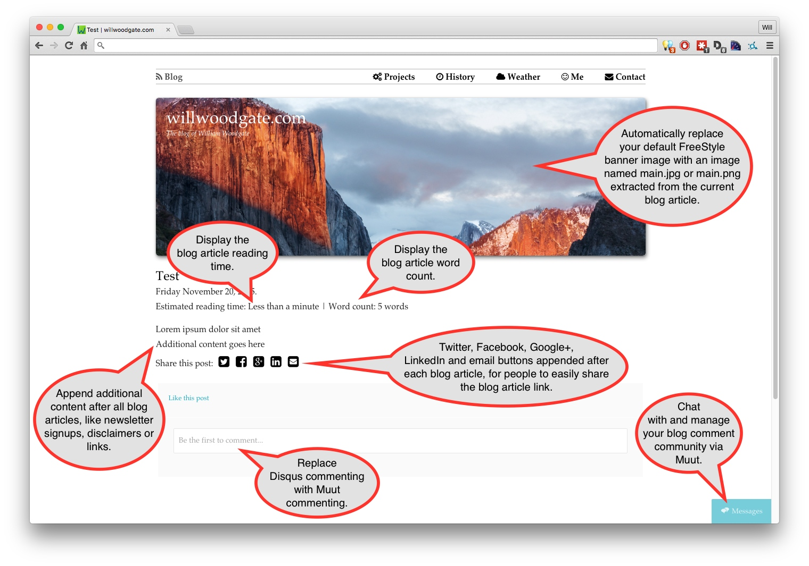

#RapidWeaver Blog Enhancement Kit
##Introduction
The Blog Enhancement Kit has been specially developed to fulfil some of the feature requests, that people often ask for; in the absence of any recent updates to the RapidWeaver blog page type. This free plugin aims to add several desirable features to the RapidWeaver blog page type; with the ultimate goal of making the blog page type more professional in function and raise it up to modern standards many people demand. 

##Supported features
Currently the Blog Enhancement Kit includes the following features:

- Any image added to a blog entry named main.jpg or main.png will get appended to the FreeStyle banner container, at the top of the page
- Display buttons (using Font Awesome icons) below each blog entry, for people to share the current article link via Google+, Facebook, Twitter, LinkedIn or email
- Display the reading time below the blog entry date (like [Medium](https://medium.com/) does) so readers can gauge its estimated reading time
- Automatically convert MP3 links into embedded HTML5 audio players
- Automatically convert MP4 links into embedded HTML5 video players
- Append additional content (like an email newsletter subscription signup forms, or links) below every blog entry
- Add support for [Muut commenting](https://muut.com/), as an alternative to Disqus
- Display the word count of the blog article, below the blog entry date

##How does it work?
The Blog Enhancement Kit is a clever, combined collection of multiple jQuery scripts and plugins; some of which are already publicly available on the internet and others which have been coded exclusively for this addon. Each has been commented, so you can go-through and delete any functionality you do not require or adjust any settings. 

To use the Blog Enhancement Kit, follow these setup instructions:

1. Open the **javascript.js** file in your preferred plain text or code editor
2. Modify any of the code, to delete features you do not want or to customise things like additional content or Muut commenting.
2. Select all the code and copy it (CMD + C) to your clipboard
3. Open RapidWeaver and click onto your blog page
4. Open the RapidWeaver Page Inspector and click on the **Header** tab
5. Click the **JavaScript** tab and paste the Javascript code snippet into the box shown
6. Save your changes and republish your website

It should be emphasised that the Blog Enhancement Kit is only scoped, tested and compatible with [ThemeFlood RapidWeaver themes](https://themeflood.com), straight out of the box. Every RapidWeaver theme company produces themes of different structure and integrity; therefore making a 'one size fits all' unfeasible. Blog Enhancement Kit could be made to work with themes from other companies, but you would need an understanding of Javascript code to make it work. Or [hire me](https://themeflood.com/support) to do it for you.

Working demo:
[http://willwoodgate.com](http://willwoodgate.com)

##Muut comment setup
Although a relatively new company, [Muut](https://muut.com/) provides a simple and clean commenting system that works really well on RapidWeaver websites. Simply go to the Muut website and signup for a new account. When prompted to choose between commenting or forums, choose commenting. You'll be give two lines of code like this:

	<a class="muut" href="https://muut.com/i/username/comments" type="dynamic">username</a>
	

Paste the first line into Blog Enhancement Kit, within the *variable* towards the top. Copy and paste the second line into your sidebar. Once published, you'll have one of the fastest, cleanest and smartest blog commenting systems available. The comment box will only get displayed below blog body pages, not on the blog summary pages.

##License
The Blog Enhancement Kit is opensource and released under the [MIT license](https://opensource.org/licenses/MIT), so anybody can download it, distribute it, use it and modify it without limitations. If you do make use of Blog Enhancement Kit in commercial projects, a credit or mention would be appreciated.

##Footnotes
The Blog Enhancement Kit can work on websites protected with an SSL certificate (https://). It will work on pages ending with either a .html or .php file extension. The social sharing buttons are completely independent with no reliance on any outside sharing services. The Blog Enhancement Kit has been tested with both RapidWeaver 5 and RapidWeaver 6. 

*RapidWeaver is a registered trademark of Realmac Software LTD*